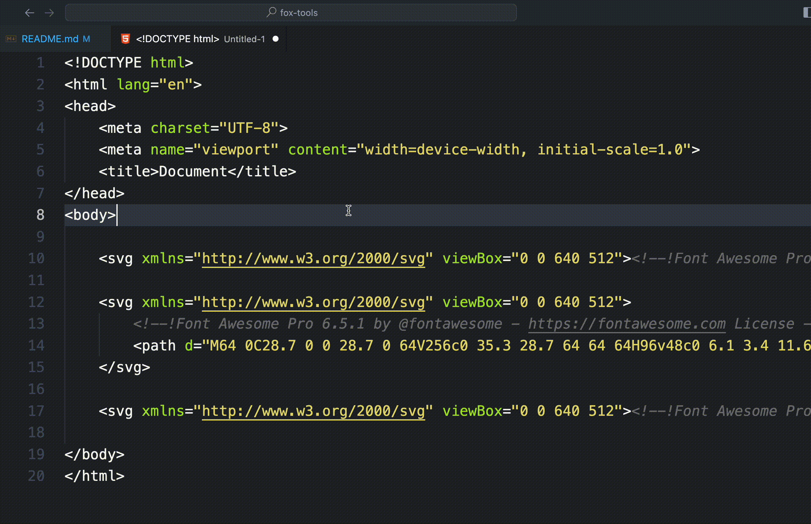

# FoxTools

Hello there, clever human! 👋

I'm your friendly neighborhood fox 🦊 and I'm here to guide you through this magical forest of code. Don't worry, I won't bite - I'm more into bugs and errors! 🐛

In this repository, you'll find all sorts of fascinating treasures, and shiny new features.

So, put on your explorer's hat, grab your keyboard, and let's embark on this coding adventure together. Remember, in the world of programming, the journey is just as important as the destination.

Happy coding, my friend! 💻 🚀

Yours in bytes and bits,
Mr. Fox 🦊

---

## Features

* **Remove Fontawesome Comments** This method removes the comments from the Fontawesome SVG images.

## How to Use

Using the Extension is quite simple:

* **PC**: `Ctrl+Shift+P` then start typing in `fox`, and select `Fox: Remove Fontawesome SVG Comments`.
* **MacOS**: `Cmd+Shift+P` then start typing in `fox`, and select `Fox: Remove Fontawesome SVG Comments`.
* **Linux**: `Ctrl+Shift+P` then start typing in `fox`, and select `Fox: Remove Fontawesome SVG Comments`.

## Release Notes

### 0.0.4

* Adding a new method to replace the xmlns attribute with the class and fill attributes.

### 0.0.3

* Adding instructions to readme, and a demo screenshot.

### 0.0.2

* Updating the readme.
* Adding a package icon.

### 0.0.1

* Initial build.
